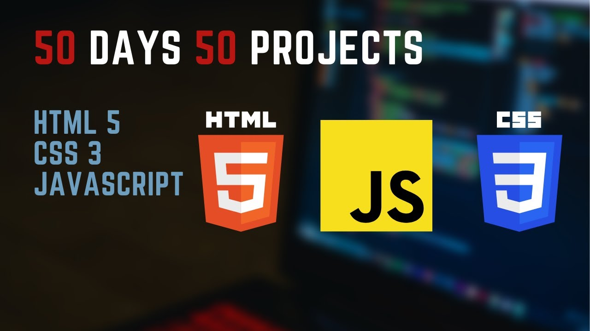

<h1 align="center">50 HTML CSS & JAVASCRIPT Projects</h1> 

Welcome to a collection of 50 exciting and diverse projects that showcase the power of HTML, CSS, and JavaScript in creating captivating animations and transitions. These projects are designed to demonstrate various animation techniques, transitions, and interactive elements to enhance your web development skills.

## Purpose

The purpose of this collection is to provide hands-on experience and inspiration for developers interested in mastering animation and transition effects in web development. Each project offers a unique insight into different aspects of creating engaging user experiences through motion and interactivity.

 

## Prerequisites

In order to run this project you need:

- Installed Git.
- Installed npm
- Installed VS code(code editor)

## Technologies

  <ul>
    <li>HTML</li>
    <li>CSS</li>
    <li>JAVASCRIPT</li>
  </ul>

## How to Use

 
Each project folder contains the necessary HTML, CSS, and JavaScript files. To run any project:

 <ol>
 <li>Clone this repository.</li>
 <li>run `npm install` to install packages </li>
 <li>Navigate to the project folder.</li>
 <li>Open the index.html file in your preferred web browser.</li>
 </ol>

Feel free to explore, modify, and experiment with the code to better understand how these animations and transitions are achieved.

(<a href="#readme-top">back to top</a>)

### Project List

<ol>
<li>

Expanding Cards

"Expanding Cards" is an interactive web layout where clicking on an image expands it while automatically minimizing other cards, offering a captivating and organized way to explore content with seamless transitions and intuitive design.

<ul>
<li><a href="https://tajulafreen.github.io/50Projects-HTML-CSS-JavaScript/Source-Code/ExpandsCards/">Live Demo</a></li>
<li><a href="https://github.com/tajulafreen/50Projects-HTML-CSS-JavaScript/tree/main/Source-Code/ExpandsCards">Source</a></li>
</ul> 

</li>

<li>

Hidden Search bar

Hidden Search Bar discreetly expands upon toggling, seamlessly integrating a sleek and intuitive search feature into interfaces, enhancing user accessibility and experience.

<ul>
<li><a href="https://tajulafreen.github.io/50Projects-HTML-CSS-JavaScript/Source-Code/HiddenSearch/">Live Demo</a></li>
<li><a href="https://github.com/tajulafreen/50Projects-HTML-CSS-JavaScript/tree/main/Source-Code/HiddenSearch">Source</a></li>
</ul> 

</li>

<li>

Blurry Image

"Blurry Image" project utilizes covert blurring on page load, gradually transitioning images from a blurred state to crystal clear, enhancing visual experience seamlessly.

<ul>
<li><a href="https://tajulafreen.github.io/50Projects-HTML-CSS-JavaScript/Source-Code/BluringImage/">Live Demo</a></li>
<li><a href="https://github.com/tajulafreen/50Projects-HTML-CSS-JavaScript/tree/main/Source-Code/BluringImage">Source</a></li>
</ul> 

</li>

<li>

Progressing steps

"Progressing Steps" project showcases dynamic button effects, visually demonstrating progression through color fills upon each click, embodying interactive advancement in just a tap.

<ul>
<li><a href="https://tajulafreen.github.io/50Projects-HTML-CSS-JavaScript/Source-Code/ProgressSteps/">Live Demo</a></li>
<li><a href="https://github.com/tajulafreen/50Projects-HTML-CSS-JavaScript/tree/main/Source-Code/ProgressSteps">Source</a></li>
</ul> 

</li>

<li>

Rotating Navigation

"Rotating Navigation" is a dynamic project where clicking the menu bar triggers a 45-degree screen rotation, offering an engaging and unique user experience through interactive navigation.

<ul>
<li><a href="https://tajulafreen.github.io/50Projects-HTML-CSS-JavaScript/Source-Code/RotatingNavigation/">Live Demo</a></li>
<li><a href="https://github.com/tajulafreen/50Projects-HTML-CSS-JavaScript/tree/main/Source-Code/RotatingNavigation">Source</a></li>
</ul> 

</li>

<li>

Scroll Animation

"Scroll Animation" is a dynamic project that imbues scrolling web pages with captivating animation effects, elevating the user experience through visually engaging content transitions triggered by scrolling actions.

<ul>
<li><a href="https://tajulafreen.github.io/50Projects-HTML-CSS-JavaScript/Source-Code/ScrollAnimation/">Live Demo</a></li>
<li><a href="https://github.com/tajulafreen/50Projects-HTML-CSS-JavaScript/tree/main/Source-Code/ScrollAnimation">Source</a></li>
</ul> 

</li>

<li>

Split Landing Page

"Experience the 'Split Landing Page' - a dynamic interface that expands upon hover, providing an immersive view, and seamlessly minimizes upon mouse removal. Engage with captivating button glow effects, adding a touch of interactivity to your browsing journey."

<ul>
<li><a href="https://tajulafreen.github.io/50Projects-HTML-CSS-JavaScript/Source-Code/SplitLanding-Page/">Live Demo</a></li>
<li><a href="https://github.com/tajulafreen/50Projects-HTML-CSS-JavaScript/tree/main/Source-Code/SplitLanding-Page">Source</a></li>
</ul> 

</li>

<li>

Form Wave Animation

Enhancing user interaction, this form features dynamic label animations with a mesmerizing wave effect, complemented by a gradient background for a stylish and immersive visual experience.

<ul>
<li><a href="https://tajulafreen.github.io/50Projects-HTML-CSS-JavaScript/Source-Code/FormWaveAnimation/">Live Demo</a></li>
<li><a href="https://github.com/tajulafreen/50Projects-HTML-CSS-JavaScript/tree/main/Source-Code/FormWaveAnimation">Source</a></li>
</ul> 

</li>

<li>

Rock Paper Scissor

Introducing a classic Rock, Paper, Scissors game with a modern twist. Experience the thrill of strategic choices and animated outcomes in this engaging web application, designed for both fun and interactive play.

<ul>
<li><a href="https://tajulafreen.github.io/50Projects-HTML-CSS-JavaScript/Source-Code/RockPapperScissor/">Live Demo</a></li>
<li><a href="https://github.com/tajulafreen/50Projects-HTML-CSS-JavaScript/tree/main/Source-Code/RockPapperScissor">Source</a></li>
</ul> 

</li>

<li>

The Weather

Weather App automatically detects your location using navigator, providing real-time weather updates tailored to your area. Enjoy intuitive design, accurate forecasts, and dynamic backgrounds based on current weather conditions for a seamless weather browsing experience. Stay informed and prepared with our convenient and user-friendly Weather App with Location Detection.

<ul>
<li><a href="https://tajulafreen.github.io/50Projects-HTML-CSS-JavaScript/Source-Code/WeatherApp/">Live Demo</a></li>
<li><a href="https://github.com/tajulafreen/50Projects-HTML-CSS-JavaScript/tree/main/Source-Code/WeatherApp">Source</a></li>
</ul> 

</li>

<li>

Event Code

The Event Code project is a simple web application that allows users to obtain the keycode of any key they press on their keyboard. Built using HTML, CSS, and JavaScript, the application provides a user-friendly interface where users can press any key, and the corresponding keycode will be displayed on the screen in real-time. This project serves as a practical demonstration of event handling in web development and can be used as a learning tool for understanding keyboard events in JavaScript.

<ul>
<li><a href="https://tajulafreen.github.io/50Projects-HTML-CSS-JavaScript/Source-Code/EventCode/">Live Demo</a></li>
<li><a href="https://github.com/tajulafreen/50Projects-HTML-CSS-JavaScript/tree/main/Source-Code/EventCode">Source</a></li>
</ul> 

</li>

</ol>

(<a href="#readme-top">back to top</a>)

## Contribution

If you wish to contribute to this collection by adding your own projects or enhancing existing ones, please follow these steps:

<ul>
<li>Fork this repository.</li>
<li>Create a new branch `(git checkout -b feature/add-your-feature)`. </li>
<li>Make your modifications.</li>
<li>Commit your changes `(git commit -am 'Add new feature')`.</li>
<li>Push to the branch `(git push origin feature/add-your-feature)`.</li>
<li>Create a new Pull Request.</li>
</ul>

Contributions, issues, and feature requests are welcome! Feel free to check the issues page.

## Credits

These projects were curated and developed by <a href="https://github.com/tajulafreen/">Tajul Afreen</a>
 and inspired by various online resources and tutorials. Contributions from the open-source community are welcomed and appreciated.

👤 **Tajul Afreen**

- GitHub: [tajulafreen](https://github.com/tajulafreen)
- LinkedIn: [tajul-afreen](https://www.linkedin.com/in/tajul-afreen/)
- Wellfound: [tajul-afreen](https://wellfound.com/u/tajul-afreen)
- Twitter: [tajulafreen](https://www.twitter.com/tajulafreen)

(<a href="#readme-top">back to top</a>)

## ⭐️ Show your support 

If you liked this project, give it a ⭐️ and kindly send to me an e-mail expressing it, it would make our day and fuel our motivation.

## 📝 License 

This project is [MIT](./LICENSE) licensed.

(<a href="#readme-top">back to top</a>)

